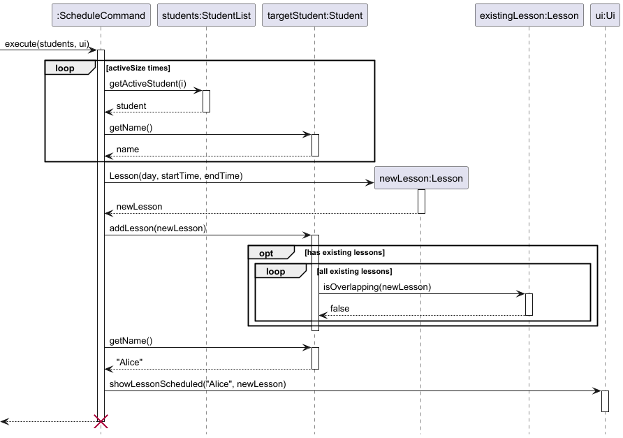
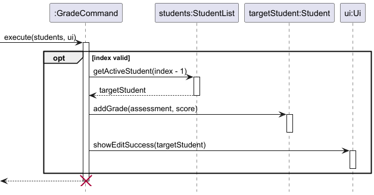

# Developer Guide

## Acknowledgements

{list here sources of all reused/adapted ideas, code, documentation, and third-party libraries -- include links to the original source as well}

## Design

{Describe the design and implementation of the product. Use UML diagrams and short code snippets where applicable.}

## Implementation

This section describes some noteworthy details on how certain features are implemented.

### Edit Student Feature

The edit mechanism allows the user to modify an existing student's details (name, academic level, and/or subject). 
It is facilitated primarily by the `EditCommand`, `StudentList`, and `Student` classes.

The edit feature's core logic resides within the `Student#editStudent(String name, String academicLevel, String subject)` method. 
The operation is executed through the following sequence:

1. `EditCommand#execute(students, ui)` is invoked
2. The command validates the provided `studentIndex`. 
If it is out of bounds (less than 1 or greater than the active list size), a TutorSwiftException is thrown.
3. The target student is retrieved using `StudentList#getActiveStudent(studentIndex - 1)` to account for 0-based list indexing.
4. It calls `Student#editStudent(...)`, passing in the new values and updates the student details accordingly.

Given below is an example usage scenario and how the edit mechanism behaves at each step.

Step 1.  The user launches the application. The StudentList contains an active student named "Alice" at index 1, who is taking "Math" and is "Primary 3".

Step 2. The user decides to switch the subject that "Alice" is taking to "Science", and executes the command `edit 1 sub/Science`.

Step 3. The parser interprets the user input and instantiates an `EditCommand` object with the `studentIndex` 1, and the new subject "Science" (with `newName` and `newLevel` left as null).

Step 4. The `EditCommand#execute()` method is called. It verifies that index 1 is within bounds and retrieves "Alice" from the StudentList using index 0.

Step 5. The command calls `studentToEdit.editStudent(null, null, "Science")`. The Student object skips the name and academic level updates. It detects that "Science" does not equal "Math". Consequently, it updates the subject to "Science".

Step 6. The `Ui` is called to display a success message showing Alice's updated profile.

The following sequence diagram shows how an edit operation executes through the objects:

#### Design Considerations

**Aspect: How student details are accessed and updated.**

- **Alternative 1 (Current Choice)**: Pass the raw string arguments into `Student#editStudent()` and let the Student class handle the null checks and updates internally.

  - Pros: High cohesion and encapsulation. The EditCommand doesn't need to know the internal logic of how a student's attributes are stored or modified.

  - Cons: The editStudent method parameter list can become long if more fields (e.g., phone number, email) are added in the future.

- **Alternative 2**: Use setter methods directly inside EditCommand** (e.g., if (newName != null) student.setName(newName);).

  - Pros: Keeps the Student class slightly smaller by removing the dedicated editStudent method.

  - Cons: Breaks encapsulation. It forces the command logic to be overly aware of the student's internal structure.

### Schedule Lesson Feature

The schedule mechanism allows the user to assign a new lesson timing to an existing student.
It is facilitated primarily by the `ScheduleCommand`, `StudentList`, `Student`, and `Lesson` classes.

The core logic resides within the `ScheduleCommand#execute()` method and `Student#addLesson(Lesson)`.
The operation is executed through the following sequence:

1. `ScheduleCommand#execute(students, ui)` is invoked.

2. The command retrieves the target student from the `StudentList` using the provided `studentName`.
If the student is not found, a `TutorSwiftException` is thrown.

3. A new `Lesson` object is instantiated using the provided `DayOfWeek`, `startTime`, and `endTime`.

4. It calls `Student#addLesson(newLesson)`. Inside this method, the new lesson is checked against the student's existing lessons. 
If an overlap is detected, a TutorSwiftException is thrown. Otherwise, it is appended to the student's internal list of lessons.

5. The `Ui#showLessonScheduled(String studentName, Lesson lesson)` is called to display a success message to the user.

Given below is an example usage scenario and how the schedule mechanism behaves at each step.

Step 1. The user launches the application. The `StudentList` contains an active student named "Alice".

Step 2. The user decides to schedule a 2-hour Math lesson for Alice on Monday morning, and executes the command `schedule Alice day/Monday start/10:00 end/12:00`.

Step 3. The parser interprets the user input and instantiates a `ScheduleCommand` object with `studentName` "Alice", `day` MONDAY, `startTime` 10:00, and `endTime` 12:00.

Step 4. The `ScheduleCommand#execute()` method is called. It queries the `StudentList` and successfully retrieves the `Student` object corresponding to "Alice".

Step 5. The command instantiates a new `Lesson` object with the given day and times.

Step 6. The command calls `targetStudent.addLesson(newLesson)`. The `Student` object iterates through its existing lessons and calls `isOverlapping(newLesson)`. 
Since Alice has no other lessons at this time, it safely appends the newly created lesson to her internal list.

Step 7. The command calls `ui.showLessonScheduled(targetStudent.getName(), newLesson)` to display a success message showing the scheduled lesson details.

The following sequence diagram shows how a schedule operation executes through the objects:

### Design Considerations

**Aspect: Handling lesson time conflicts (Double-booking).**

- **Alternative 1 (Current Choice):**  Prevent overlapping lessons for the same student, but allow overlapping lessons across different students.
  
  - Pros: Prevents illogical scheduling (e.g., booking the same student for two different lessons at the exact same time). 
    However, it still provides flexibility for the tutor if they happen to teach multiple students in a shared group-tuition setting during the exact same time slot.
  - Cons: The tutor might accidentally double-book themselves for two different 1-on-1 private lessons at the same time and the system will not warn them.

- **Alternative 2**: Prevent all overlapping lessons by validating the new time slot against all existing lessons across the entire `StudentList`.

  - Pros: Strictly prevents accidental double-booking for the tutor.
  - Cons: Requires iterating through every student's timetable every time a new lesson is scheduled using `Lesson#isOverlapping()`. 
    Furthermore, group classes would be impossible to schedule unless a new "Group" class is introduced.

### Grade Feature

#### Implementation

The `grade` command allows users to assign assessment scores to a student.  
It is facilitated by the `Parser`, `GradeCommand`, `StudentList`, and `Student` classes.

The command parsing is handled by `Parser#parseGrade()`, which extracts:
- the student index
- the assessment name (`m/`)
- the score (`g/`)

A `GradeCommand` object is then created with these parameters.

During execution, `GradeCommand#execute()` retrieves the target `Student` from `StudentList` and calls `Student#addGrade()`, which creates and stores a new `Grade` object.

---

#### Example Usage Scenario

Step 1. The user launches the application. The `StudentList` contains a student named "Alice" at index 1.

Step 2. The user executes the command:

`grade 1 m/WA1 g/85`

Step 3. The parser processes the input and creates a `GradeCommand` with:
- `index = 1`
- `assessment = "WA1"`
- `score = 85`

Step 4. `GradeCommand#execute()` is called. It validates that index 1 is within bounds.

Step 5. The command retrieves the student using `StudentList#getActiveStudent(0)`.

Step 6. The command calls:

`student.addGrade("WA1", 85)`

#### Design Considerations

**Aspect: Where to store grade logic**

- **Option 1 (chosen): Store in `Student`**
  - Keeps grade-related behavior encapsulated within the student
  - Aligns with object-oriented design (student owns its grades)

- **Option 2: Handle in `StudentList`**
  - Centralizes logic but reduces cohesion

Option 1 was chosen for better modularity and maintainability.

---

#### Notes

- Grades are stored as a list of `Grade` objects
- Duplicate assessments are allowed (no validation enforced)

## Product scope
### Target user profile

{Describe the target user profile}

### Value proposition

{Describe the value proposition: what problem does it solve?}

## User Stories

|Version| As a ... | I want to ... | So that I can ...|
|--------|----------|---------------|------------------|
|v1.0|new user|see usage instructions|refer to them when I forget how to use the application|
|v2.0|user|find a to-do item by name|locate a to-do without having to go through the entire list|

## Non-Functional Requirements

{Give non-functional requirements}

## Glossary

* *glossary item* - Definition

## Instructions for manual testing

{Give instructions on how to do a manual product testing e.g., how to load sample data to be used for testing}
